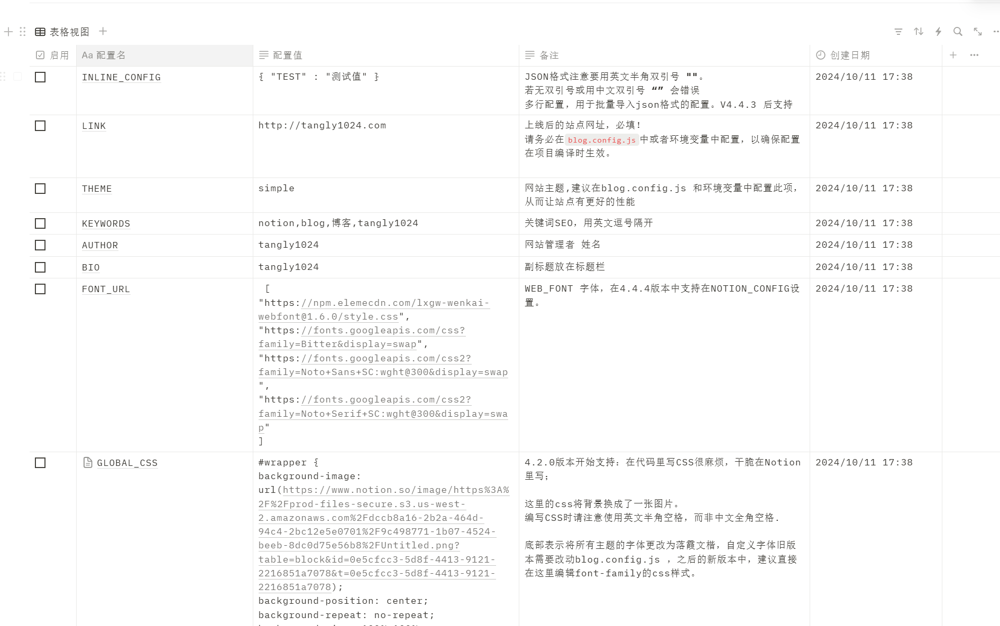
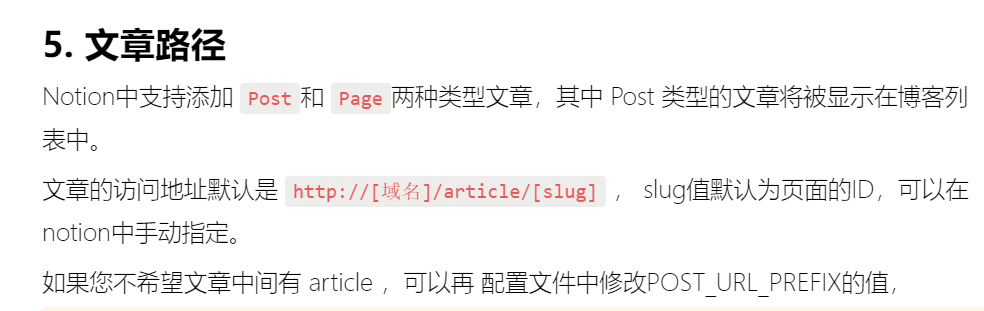

 长空御风网站配置手册———全局可更改内容

## 一些常用的配置
放在了Notion里面的Notion_Config（配置中心）下，主要以键值对的形式存在，需要勾选才能启用，可以更改其中的内容

## 顶栏能配置的内容

每个容器的文字，图片和是否存在

## Hero区能配置的内容

## feature区能配置的内容

每个图标样式，文字，了解更多跳转的地点（现在是跳到notion某个文档里面）

## 文档区能配置的内容

显示的文档个数、是否可以预览内容，图片等
规划是展示一些技术文档或者宣传动态

## 赞助区和底栏能配置的内容

赞助的商家logo
